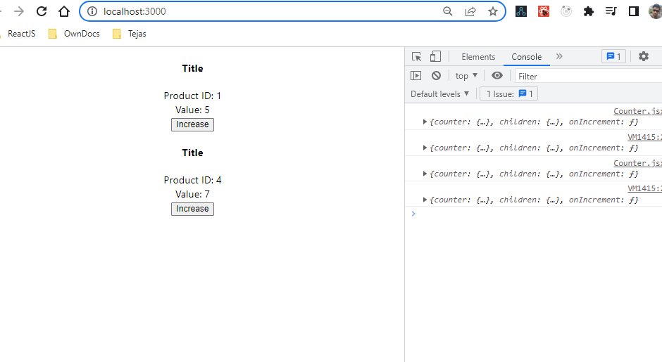
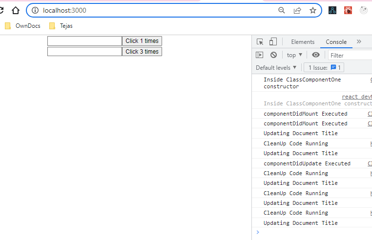
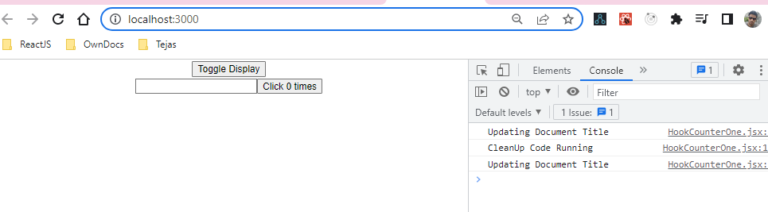

# Features and Description

## Some Basic Features Practice

- **Counters** and **Counter** are two class component that I have used for practice. Here the following features are covered
  - Basic State Usage
  - Calling a Child Component
  - Passing an event handler to child component
  - Conditional Rendering
  - Props Usage
    In order to view this App.js should be.
    It looks like the following 

```javascript
import Counters from "./components/Counters";

function App() {
  return (
    <div className="App">
      <Counters />
    </div>
  );
}
```

## UseEffect() Examples

- **HookCounterOne** is the functional component representation of **ClassComponentOne** Class Counter. This represent the useEffect hook with different Lifecycle phases and it looks like 
  In order to view this App.js should be.

```javascript
import ClassComponentOne from "./components/ClassCounterOne";
import HookCounterOne from "./components/HookCounterOne";

function App() {
  return (
    <div className="App">
      <ClassComponentOne />
      <HookCounterOne />
    </div>
  );
}
```

- **ToggleContentContainer** is the functional component representation that demonstrates **componentWillUnmount** in functional Component format. This represent the useEffect hook with different Lifecycle phases and it looks like 
  In order to view this App.js should be.

```javascript
import ToggleContentContainer from "./components/ToggleContentContainer";

function App() {
  return (
    <div className="App">
      <ToggleContentContainer></ToggleContentContainer>
    </div>
  );
}
```

- **Interval Hook Counter** is the functional component representation of **IntervalClassCounter** Class Counter. This represent the useEffect hook with different Lifecycle phases and it looks like 
  In order to view this App.js should be.

```javascript
import IntervalClassCounter from "./components/IntervalClassCounter";
import IntervalHookCounter from "./components/IntervalHookCounter";

function App() {
  return (
    <div className="App">
      <IntervalClassCounter></IntervalClassCounter>
      <IntervalHookCounter></IntervalHookCounter>
    </div>
  );
}
```

- Here we will showing how to **fetch data from an API endpoint** using **useEffect** Hook. We will be using **axios** for data-fetching

```cmd
    npm install axios
```

    We have the following implementations Done:

1.  **ExtractAllData** which extracts all data from the api https://jsonplaceholder.typicode.com/posts
2.  **ExtractDataOnChange** which extracts data with specified id from the api https://jsonplaceholder.typicode.com/posts/1 on change of the input field
3.  **ExtractDataOnBtnClick** which extracts data with specified id from the api https://jsonplaceholder.typicode.com/posts/1 on click of button

## Available Scripts

In the project directory, you can run:

#### `npm install`

To Install the dependency

#### `npm start`

Runs the app in the development mode.\
Open [http://localhost:3000](http://localhost:3000) to view it in your browser.

The page will reload when you make changes.\
You may also see any lint errors in the console.
